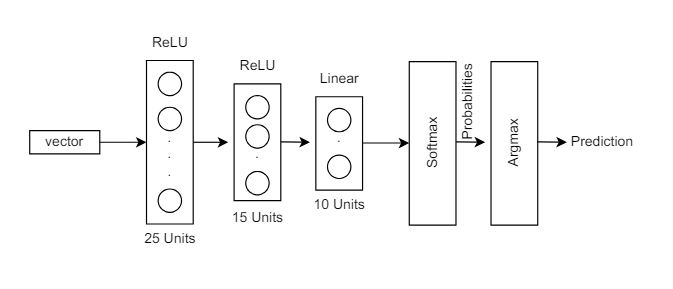
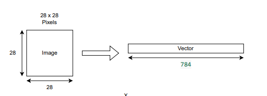
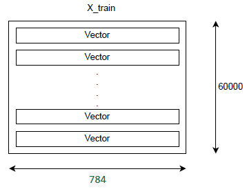

# Hand Digit Recognition Neural Network

This repository contains the implementation of a neural network model for hand digit recognition using Python and TensorFlow. The model is designed to recognize digits from images and predict the corresponding digit.

## Model Architecture

The neural network model consists of the following layers:

1. **Input Layer**: Accepts a vector of size 400.
2. **Hidden Layer 1**: Fully connected layer with 25 units and ReLU activation.
3. **Hidden Layer 2**: Fully connected layer with 15 units and ReLU activation.
4. **Output Layer**: Fully connected layer with 10 units and linear activation.
5. **Softmax Layer**: Converts the output to probabilities.
6. **Argmax Layer**: Provides the final prediction by selecting the highest probability.



### Model Layers
- **Input Layer**: A vector of size 400.
- **Hidden Layer 1**: 25 units with ReLU activation.
- **Hidden Layer 2**: 15 units with ReLU activation.
- **Output Layer**: 10 units with linear activation.
- **Softmax Layer**: Converts outputs to probabilities.
- **Argmax Layer**: Selects the highest probability as the prediction.

## Data Preparation

The dataset consists of images of hand-written digits. Each image is of size 20x20 pixels and is flattened into a vector of size 400.



### Input Data
- **Image Size**: 20x20 pixels.
- **Flattened Vector Size**: 400.

The dataset contains 5000 such vectors, each representing a hand-written digit.



### Dataset
- **Total Images**: 5000.
- **Vector Size**: 400.

## Jupyter Notebook

The implementation of the neural network model is provided in the Jupyter Notebook `Hand_Digit_Recognition.ipynb`. This notebook includes data preprocessing, model training, and evaluation.

## Usage

To use this repository, follow these steps:

1. Clone the repository:
   ```bash
   git clone https://github.com/yourusername/hand-digit-recognition.git
